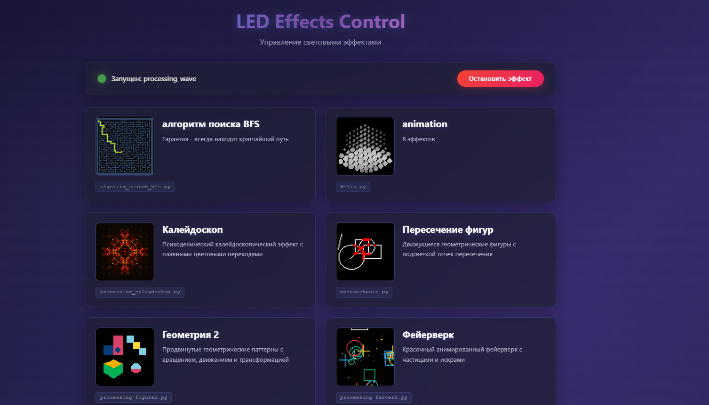

# LED Effects Control Server

Веб-интерфейс для управления световыми эффектами LED матрицы 64x64.

## Возможности

- 🎨 Красивый современный веб-интерфейс
- ⚡ Запуск и остановка эффектов одним кликом
- 📝 Автоматическая загрузка названий и описаний эффектов
- 🔄 Отслеживание текущего запущенного эффекта
- 📱 Адаптивный дизайн

## Установка
1. качаем тут образ https://dietpi.com/#downloadinfo
2. ставим образ на SD
3. настраиваем wifi и пароль  root https://dietpi.com/docs/install/
```
настройка wifi log\pass

To setup the WiFi, open the SD card folder, and update next two files using a text editor of your choice:

1. Open the file named `dietpi.txt`. Find `AUTO_SETUP_NET_WIFI_ENABLED` and set to value 1.
2. Open the file `dietpi-wifi.txt` and set `aWIFI_SSID[0]` to the name of your WiFi network.
3. In the same file `dietpi-wifi.txt`, set `aWIFI_KEY[0]` to the password of your WiFi network.
4. Save and close the files
```

```
настройка пароля рута 

A login prompt will appear. Use the initial credentials:

- login: `root`
- password: `dietpi` (resp. the one you set via `dietpi.txt`)

```

1. Установите необходимые зависимости:

```bash
pip install flask
```

2. Убедитесь, что установлены зависимости для эффектов:

```bash
pip install pillow numpy noise opensimplex
```

## Запуск сервера

```bash
cd rpi_server
python app.py
```

Сервер будет доступен по адресу: `http://localhost:5000`

Для доступа из локальной сети используйте IP-адрес вашего устройства.

## Добавление новых эффектов

1. Создайте Python файл в папке `effects/`
2. Добавьте в начало файла метаданные:

```python
#!/usr/bin/env python
# НАЗВАНИЕ: Название эффекта
# ОПИСАНИЕ: Описание того, что делает эффект
```

3. Эффект автоматически появится в веб-интерфейсе

**Важно:** Эффекты без метаданных (НАЗВАНИЕ и ОПИСАНИЕ) не будут отображаться в интерфейсе.

## Структура проекта

```
rpi_server/
├── app.py                  # Flask веб-сервер
├── templates/
│   └── index.html         # Веб-интерфейс
├── effects/               # Папка с эффектами
│   ├── peresechenie.py
│   ├── processing_wave.py
│   └── ...
└── README.md
```

## API Endpoints

- `GET /` - Главная страница с интерфейсом
- `GET /api/effects` - Список доступных эффектов
- `GET /api/effects/current` - Текущий запущенный эффект
- `POST /api/effects/start` - Запустить эффект
- `POST /api/effects/stop` - Остановить эффект

## Примеры использования API

### Получить список эффектов

```bash
curl http://localhost:5000/api/effects
```

### Запустить эффект

```bash
curl -X POST http://localhost:5000/api/effects/start \
  -H "Content-Type: application/json" \
  -d '{"effect": "peresechenie"}'
```

### Остановить эффект

```bash
curl -X POST http://localhost:5000/api/effects/stop
```

